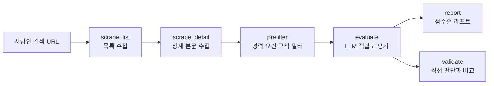

# Job Fit Scanner

사람인 검색 결과를 모아서, 내 프로필과 얼마나 맞는지 LLM으로 점수를 매기는 개인용 도구입니다.
매일 아침 컴퓨터를 켜면 자동으로 새 공고를 모으고 평가해서, 볼 만한 공고만 정리된 리포트를 브라우저로 띄워줍니다.
LLM 점수를 그냥 믿지 않고, 공고 20건을 직접 판단해서 LLM 판단과 얼마나 일치하는지도 확인했습니다.

## 만든 이유

사람인에서 서울/경기/충남, IT개발·데이터 조건으로 검색했더니 결과가 9,600건이었습니다.
하나씩 열어보는 건 불가능했고, 제목만 보고 거르면 "경력 3년 이상"이 본문 깊숙이 적힌 공고에
시간을 쓰게 됐습니다. 그래서 "본문까지 읽고 1차로 걸러주는" 단계를 자동화해보기로 했습니다.

## 구조



| 단계 | 파일 | 하는 일 |
|---|---|---|
| 목록 수집 | `src/scrape_list.py` | 검색 결과 페이지에서 제목·회사·공고 번호 수집 |
| 상세 수집 | `src/scrape_detail.py` | 본문 전용 주소(view-detail)에서 상세요강 저장 (iframe, 이미지 OCR 처리) |
| 사전 필터 | `src/prefilter.py` | 필수 경력 연차가 높은 공고를 규칙으로 제외해 LLM 호출 수를 줄임 |
| 평가 | `src/evaluate.py` | 공고 본문 + 내 프로필을 LLM에 보내 점수·신입 가능 여부·관련 경험·부족한 점을 JSON으로 받음 |
| 검증 | `src/validate.py` | 점수 구간별로 20건을 뽑아 직접 판단하고, 모델별 일치도 계산 |
| 리포트 | `src/report.py` | 점수순 리포트 생성 (마크다운, 브라우저용 HTML) |
| 일일 실행 | `src/daily.py`, `run_daily.bat` | 위 단계를 한 번에 돌리고 '오늘의 새 공고' 리포트를 띄움 |
| 현황 | `src/stats.py` | 단계별 진행 건수 확인 |

## 모델 선택

처음엔 로컬 모델(Ollama, qwen2.5:3b)을 기본으로 생각했습니다. 비용이 없고 데이터가 밖으로 나가지 않기 때문입니다.
그런데 실제로 돌려보니 두 가지 문제가 있었습니다.

- **속도**: GPU가 없는 노트북(CPU만 사용)에서 공고 하나에 1~2분, 긴 공고는 10분을 넘기기도 했습니다. 매일 아침 수십 건을 처리하기엔 너무 느렸습니다.
- **정확도**: 같은 공고 3건을 두 모델로 평가해 이유를 비교했더니, 3B 모델은 공고에 없는 "AI 개발" 부문을 지어내 50점을 줬습니다. Gemini는 실제 모집 부문(비서, 영업, DBA, 모바일 앱 개발 등)을 하나씩 짚고 맞는 부문이 없다고 판단했고, 부문별 "경력 5년 이상" 요건이나 근무지(전북 군산)까지 읽어냈습니다.

그래서 기본은 **Gemini(gemini-3.5-flash-lite, 무료 등급)**로 바꾸고, Ollama는 인터넷이나 API 한도 없이 써야 할 때의 예비용으로 남겨뒀습니다(`--backend ollama`).
평가 결과는 모델별로 따로 저장되기 때문에 같은 공고에 대한 두 모델의 점수를 나란히 비교할 수 있습니다.

## 만들면서 부딪힌 문제

| 문제 | 원인 | 해결 |
|---|---|---|
| 2페이지를 요청해도 계속 1페이지가 나옴 | 세션 없이 요청하면 페이지 파라미터가 무시됨 | 같은 세션으로 1페이지를 먼저 열고 이어서 요청 |
| 검색 결과 50건 중 46건의 링크로 상세 페이지가 안 열림 | 일반 공고 링크와 '기업 채용관' 링크가 섞여 있었음 | 링크 대신 카드 div의 `id="rec-번호"`에서 공고 번호를 꺼내 상세 URL 생성 |
| 여러 부문을 한 번에 뽑는 공고("각 부문 채용")의 점수가 애매함 | 영업·회계 등 다른 부문까지 섞어서 평가 | 지원자에게 가장 맞는 부문 하나를 골라 평가하고, 이유 앞에 `[부문명]`을 붙이도록 프롬프트 수정 |
| 로컬 모델이 특정 공고에서 10분 넘게 멈춤 | 작은 모델이 JSON 모드에서 답을 끝내지 못하고 공백을 이어 쓰는 경우 + 긴 입력 | 출력 길이 상한(600토큰), 본문 4,000자 제한, 시간 초과 시 그 공고만 건너뛰기 |
| 공고 제목 자리에 회사명이 저장됨 | 카드 안에서 회사명 링크와 제목 링크가 같은 클래스(`a.str_tit`)를 씀 | 회사명 영역(`div.company_nm`) 밖의 링크만 제목으로 사용 |
| 상세 본문 대신 "불러오고 있습니다"만 저장됨 | 상세 페이지가 자바스크립트로 내용을 불러옴 | 처음엔 Playwright(headless Chromium)로 페이지를 렌더링 |
| Playwright 접속이 첫 요청부터 끊김 (ERR_CONNECTION_RESET) | 일반 크롬과 일반 요청은 정상이었음. 요청량보다는 자동화 브라우저 접속이 제한되는 것으로 판단 | 브라우저를 위장하거나 접속 제한을 피하는 방식은 쓰지 않음. 대신 브라우저를 아예 빼고, 페이지가 본문을 불러올 때 쓰는 주소(`relay/view-detail`)에 일반 요청을 보내 필요한 본문만 받도록 바꿈. 페이지 전체를 렌더링하지 않아 요청이 가벼워졌고, 사이트 메뉴가 빠져 LLM 입력도 깔끔해짐 |
| 일부 공고는 본문이 몇 줄뿐 | 회사 채용 사이트를 iframe으로 넣어둔 공고 | iframe 주소를 한 번 더 요청해 합침 |
| 본문이 이미지뿐인 공고 | 채용공고를 이미지로 올린 경우 | Tesseract OCR(한국어)로 글자 추출 |

차단을 겪은 뒤로는 요청 간격 5초, 연속 3회 실패 시 자동 중단을 기본으로 두고, 한 번에 최대 100건 정도만 모으는 걸 전제로 합니다.

## 검증 결과

> 실제로 돌린 뒤 `python src/validate.py report` 출력을 여기에 옮겨 적습니다.

| 모델 | 건수 | 판단 일치율 | 한 단계 이내 | Cohen's kappa | Spearman |
|---|---|---|---|---|---|
| gemini:gemini-3.5-flash-lite | | | | | |
| ollama:qwen2.5:3b (선택) | | | | | |

- 판단은 지원 / 보류 / 제외 3단계, LLM 점수는 70점 이상 지원, 40~69점 보류, 그 미만 제외로 변환
- 20건은 점수 구간별로 고르게 뽑았고, 직접 판단할 때는 LLM 점수를 보지 않았습니다
- 판단이 엇갈린 사례와 그 원인:
  - (작성 예정)

## 설치

Windows cmd 기준입니다.

```
python -m venv venv
venv\Scripts\activate
pip install -r requirements.txt
copy profile.example.md profile.md
copy .env.example .env
```

- `profile.md`: 내 학력·스택·프로젝트, 그리고 **경험이 없는 것**까지 적습니다. LLM에 그대로 들어가므로 이름이나 연락처는 넣지 않습니다.
- `.env`: Gemini API 키와 매일 확인할 사람인 검색 URL을 넣습니다.
- 이미지 공고 OCR이 필요하면 Tesseract(한국어 언어팩 포함)를 따로 설치합니다. 없으면 OCR만 건너뜁니다.

## 사용법

### 처음 한 번: 검색 결과 전체 훑기

```
python src/daily.py --full "사람인 검색결과 URL"
```

URL을 생략하면 `.env`의 `SEARCH_URL`을 씁니다. 검색 결과를 전부 모으고, 본문은 50건씩 받으면서 사이사이 20분씩 쉬어서 사이트에 부담을 주지 않게 합니다.
본문을 다 받으면 전체를 평가하고, 전체 중 상위 30건을 `reports/latest.html`로 띄웁니다.
공고 400건 기준으로 휴식 시간 포함 3~4시간 정도 걸려서 자기 전에 돌려두는 용도입니다. 중간에 접속이 막히면 이미 받은 공고로 평가와 리포트까지 진행합니다.

### 매일 아침 자동 실행

`run_daily.bat`를 작업 스케줄러에 '로그온할 때' 실행으로 등록하면, 아침에 컴퓨터를 켜고 로그인할 때마다 하루 한 번 아래 과정이 돌고 리포트가 브라우저로 열립니다.

```
schtasks /create /tn "JobFitScanner" /tr "\"C:\경로\job-fit-scanner\run_daily.bat\"" /sc onlogon /delay 0002:00
```

1. 새 공고 목록 수집 (기본 2페이지)
2. 본문이 없는 공고만 본문 수집 (기본 최대 40건, 5초 간격)
3. 사전 필터
4. Gemini 평가 (아직 평가 안 된 공고만)
5. 이번 실행에서 새로 평가된 공고만 담은 `reports/latest.html` 생성 후 열기

같은 날 다시 로그인해도 다시 돌지 않고, 중간에 사람인 접속이 실패해도 이미 모인 공고로 평가와 리포트까지는 진행합니다. 실행 기록은 `logs/daily.log`에 남습니다.

### 단계별로 직접 실행

```
python src/scrape_list.py "사람인 검색결과 URL" --max-pages 2
python src/scrape_detail.py --limit 20
python src/prefilter.py
python src/evaluate.py
python src/report.py --html
python src/stats.py
```

### 검증

```
python src/validate.py sample --model gemini:gemini-3.5-flash-lite --n 20
python src/validate.py label
python src/validate.py report
```

## 한계

- 검색 조건에 이미 '신입·경력무관'을 걸었고, 여러 부문 공고는 한 부문만 신입이어도 '신입' 표기가 있어서 사전 필터는 실제로 거의 걸러내지 못합니다. 부문별 경력 요건은 결국 LLM이 읽어야 합니다.
- 사전 필터는 정규식이라 "경력 8년 이상, 또는 관련 프로젝트 경험" 같은 대체 조건을 읽지 못하고 제외할 수 있습니다. 그래서 제외된 공고도 리포트 끝에 이유와 함께 남겨둡니다.
- 사람인 페이지 구조가 바뀌면 선택자(`div.list_item`, `a.str_tit`, `div.company_nm`)를 다시 확인해야 합니다.
- 검증 표본이 20건이라 수치는 참고용입니다.
- Gemini 무료 등급은 입력 내용이 Google 제품 개선에 쓰일 수 있어서, 공개된 공고 텍스트와 개인정보를 뺀 프로필만 보냅니다.

## 이용 원칙

이 도구는 개인 구직을 위해 만들었고, 아래 원칙을 지키도록 설계했습니다.

- 요청 사이 5초 간격, 50건마다 휴식(기본 20분), 연속 3회 실패 시 자동 중단
- 접속 제한을 우회하는 기능(브라우저 위장, 프록시 등)은 넣지 않음
- 수집한 공고 데이터는 개인 PC에만 저장하고 재배포하거나 상업적으로 쓰지 않음
- 대상 사이트의 이용약관과 정책은 사용하는 사람이 직접 확인해야 하며, 사이트가 자동 수집을 원하지 않는 경우 사용하지 않는 것이 맞습니다

## 데이터

수집한 공고 원문, DB, 리포트는 저장소에 올리지 않았습니다 (`.gitignore`의 `data/`, `reports/`).
개인 구직용으로 소량만 수집했고, 수집한 데이터를 재배포하지 않습니다.
