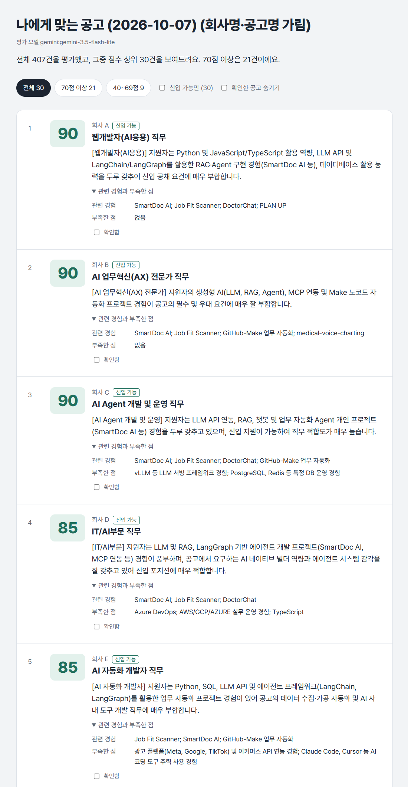
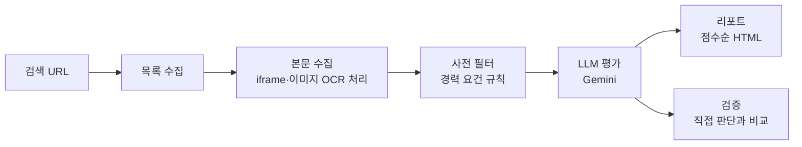

# Job Fit Scanner

채용 사이트에서 조건을 걸어 검색한 공고 수백 건을 AI가 대신 읽고,
**내 이력과 얼마나 맞는지 점수와 이유를 붙여서 상위 공고만 보여주는** 개인용 구직 도구입니다.



<sub>실제로 실행해서 나온 리포트 화면입니다. 점수와 평가 내용은 그대로이고, 회사명·공고 제목·링크만 가렸습니다(`report.py --anonymize`).</sub>

## 한눈에 보기

| | |
|---|---|
| **입력** | 사람인 검색결과 URL 하나 + 내 프로필(`profile.md`) |
| **하는 일** | 공고 목록·본문 수집 → 경력 요건 규칙 필터 → LLM(Gemini)이 공고마다 점수·이유·관련 경험·부족한 점 작성 |
| **결과** | 점수순 리포트(브라우저용 HTML). 점수 구간·신입 가능 여부로 걸러보고, 확인한 공고는 체크해둘 수 있음 |
| **실행** | 명령어 한 줄. 처음엔 검색 결과 전체를 훑고, 그다음부터는 새로 올라온 공고만 처리 |
| **규모** | 조건 검색 결과 403건 전체를 평가. Gemini 기준 공고당 약 2초 |
| **검증** | 20건을 본인 기준으로 판단해 비교: 3단계 일치율 75%, 한 단계 이내 95%, 지원하려던 공고를 AI가 제외한 경우 0건 |

## 만든 이유

사람인에서 서울/경기/충남, IT개발·데이터 조건으로 검색했더니 결과가 9,600건이었습니다.
하나씩 열어보는 건 불가능했고, 제목만 보고 고르면 본문 깊숙이 "경력 3년 이상"이 적힌 공고에 시간을 쓰게 됐습니다.

그래서 **본문까지 읽고 1차로 걸러주는 단계**를 자동화했습니다. 다만 AI 점수를 그대로 믿지 않도록,
공고 일부를 본인 기준으로 판단해서 AI 판단과 얼마나 일치하는지 비교하는 검증 단계도 함께 만들었습니다.

## 범위를 이렇게 정한 이유

처음 목표는 "검색 URL만 넣으면 수천 건이라도 전부 읽고 상위 20\~30개를 골라주는 것"이었습니다.
그런데 실제로 계산해보니 지금 환경에서는 무리였습니다.

- **수집 시간과 사이트 부담**: 공고 본문은 한 건씩 받아야 하는데, 사이트에 부담을 주지 않으려고 요청 사이에 5초 간격을 뒀습니다. 이 속도면 4,000건에 5시간 반이 걸리고, 하루에 수천 번 요청하는 것 자체가 개인 구직 용도를 넘어선다고 판단했습니다.
- **API 한도**: 평가에 쓰는 Gemini 무료 등급은 이 모델 기준 하루 요청 수가 500회 정도로 제한돼 있어서, 수천 건을 하루에 평가할 수 없습니다.

그래서 **검색 조건을 좁혀서(신입·경력 3년 이하, 기업 규모 등) 결과를 403건으로 만든 뒤, 그 결과 전체를 빠짐없이 평가하는 방식**으로 범위를 정했습니다.
임의로 앞의 400건만 자른 게 아니라, 조건에 맞는 검색 결과는 전부 봅니다. 처음 한 번 전체를 훑은 뒤에는 매일 새로 올라온 공고만 처리하기 때문에, 이후 들어오는 공고도 놓치지 않습니다.

규모를 더 키우려면 공고 목록에 나오는 요약 정보(제목, 경력, 지역 등)만으로 1차 선별한 뒤 남은 공고만 본문을 읽는 2단계 구조가 필요하고, 이는 개선 방향으로 남겨뒀습니다.

## 어떻게 동작하나요



| 단계 | 파일 | 하는 일 |
|---|---|---|
| 목록 수집 | `src/scrape_list.py` | 검색 결과 페이지에서 제목·회사·공고 번호 수집. 이미 저장된 공고는 건너뜀 |
| 본문 수집 | `src/scrape_detail.py` | 공고 본문(상세요강)을 받아 저장. 회사 채용 사이트를 끼워 넣은 공고(iframe)와 이미지 공고(OCR)도 처리 |
| 사전 필터 | `src/prefilter.py` | 필수 경력 연차가 높은 공고를 규칙으로 걸러 LLM 호출 수를 줄임 |
| 평가 | `src/evaluate.py` | 공고 본문 + 내 프로필을 LLM에 보내 점수·신입 가능 여부·관련 경험·부족한 점을 JSON으로 받음 |
| 리포트 | `src/report.py` | 점수순 리포트 생성 (마크다운, 브라우저용 HTML) |
| 검증 | `src/validate.py` | 점수 구간별로 공고를 뽑아 직접 판단하고, AI 판단과의 일치도 계산 |
| 한 번에 실행 | `src/daily.py` | 위 단계를 순서대로 실행. 전체 훑기 모드와 매일 모드 |
| 현황 | `src/stats.py` | 단계별 진행 건수 확인 |

## 평가 방식

AI는 지원자를 따로 알지 못합니다. 공고 하나를 평가할 때마다 아래 세 가지를 한 묶음으로 보내고, 그 안에서만 판단하게 했습니다.

1. **평가 규칙**: 채용 담당자 역할, 점수 기준, 지켜야 할 규칙
2. **지원자 프로필** (`profile.md`): 학력, 기술, 프로젝트, 희망 조건, 그리고 **경험이 없는 것**
3. **공고 본문**: 사이트 메뉴 등을 빼고 업무·자격요건 위주로. Gemini에는 최대 15,000자, 로컬 모델에는 4,000자

**점수 기준**

| 점수 | 의미 |
|---|---|
| 80\~100 | 핵심 업무와 필수 요건 대부분을 프로필 경험으로 설명할 수 있고 신입·주니어 지원 가능 |
| 50\~79 | 일부 요건은 맞지만 중요한 기술이나 경험이 빠져 있음 |
| 20\~49 | 핵심 기술 스택이나 경력 요건이 맞지 않음 |
| 0\~19 | 직군 자체가 다름 |

**지키게 한 규칙**

- 공고에 실제로 적힌 내용만 근거로 삼고, 프로필에 없는 경험을 있다고 가정하지 않기
- 필수 경력과 우대 경력을 구분하기. "또는 이에 준하는 역량" 같은 대체 조건이 있으면 감안하기
- "각 부문 채용"처럼 여러 직무를 한 번에 뽑는 공고는, 지원자에게 가장 맞는 부문 하나를 골라 평가하고 이유 앞에 `[부문명]` 붙이기

**AI가 돌려주는 결과 (예시)**

```json
{
  "match_score": 45,
  "junior_ok": true,
  "reason": "[시스템기획] 신입 지원은 가능하지만, 지원 자격의 IT 컴플라이언스(내부회계, ISMS) 대응 경험이 없습니다.",
  "matched_projects": ["반도체 생산관리시스템 운영지원"],
  "missing_skills": ["내부회계(ITGC)", "SAP 모듈 PI"]
}
```

## 모델 선택

처음엔 로컬 모델(Ollama, qwen2.5:3b)을 기본으로 생각했습니다. 비용이 없고 데이터가 밖으로 나가지 않기 때문입니다.
그런데 실제로 돌려보니 두 가지 문제가 있었습니다.

- **속도**: GPU가 없는 노트북(CPU만 사용)에서 공고 하나에 1\~2분, 긴 공고는 10분을 넘기기도 했습니다. 수백 건을 처리하기엔 너무 느렸습니다.
- **정확도**: 같은 공고 3건을 두 모델로 평가해 이유를 비교했더니, 3B 모델은 공고에 없는 "AI 개발" 부문을 지어내 50점을 줬습니다. Gemini는 실제 모집 부문(비서, 영업, DBA, 모바일 앱 개발 등)을 하나씩 짚고 맞는 부문이 없다고 판단했고, 부문별 "경력 5년 이상" 요건이나 근무지(전북 군산)까지 읽어냈습니다.

그래서 기본은 **Gemini(gemini-3.5-flash-lite, 무료 등급)**로 바꾸고, Ollama는 인터넷이나 API 한도 없이 써야 할 때의 예비용으로 남겨뒀습니다(`--backend ollama`).
평가 결과는 모델별로 따로 저장되기 때문에 같은 공고에 대한 두 모델의 점수를 나란히 비교할 수 있습니다.

## 만들면서 부딪힌 문제

| 문제 | 원인 | 해결 |
|---|---|---|
| 2페이지를 요청해도 계속 1페이지가 나옴 | 세션 없이 요청하면 페이지 파라미터가 무시됨 | 같은 세션으로 1페이지를 먼저 열고 이어서 요청 |
| 검색 결과 50건 중 46건의 링크로 상세 페이지가 안 열림 | 일반 공고 링크와 '기업 채용관' 링크가 섞여 있었음 | 링크 대신 카드 div의 `id="rec-번호"`에서 공고 번호를 꺼내 상세 URL 생성 |
| 공고 제목 자리에 회사명이 저장됨 | 카드 안에서 회사명 링크와 제목 링크가 같은 클래스(`a.str_tit`)를 씀 | 회사명 영역(`div.company_nm`) 밖의 링크만 제목으로 사용 |
| 본문 대신 "불러오고 있습니다"만 저장됨 | 상세 페이지가 자바스크립트로 내용을 불러옴 | 처음엔 Playwright(headless Chromium)로 페이지를 렌더링 |
| Playwright 접속이 첫 요청부터 끊김 (ERR_CONNECTION_RESET) | 일반 크롬과 일반 요청은 정상이었음. 요청량보다는 자동화 브라우저 접속이 제한되는 것으로 판단 | 브라우저를 위장하거나 접속 제한을 피하는 방식은 쓰지 않음. 대신 브라우저를 아예 빼고, 페이지가 본문을 불러올 때 쓰는 주소(`relay/view-detail`)에 일반 요청을 보내 필요한 본문만 받도록 바꿈. 페이지 전체를 렌더링하지 않아 요청이 가벼워졌고, 사이트 메뉴가 빠져 LLM 입력도 깔끔해짐 |
| 일부 공고는 본문이 몇 줄뿐 | 회사 채용 사이트를 iframe으로 넣어둔 공고 | iframe 주소를 한 번 더 요청해 합침 |
| 본문이 이미지뿐인 공고 | 채용공고를 이미지로 올린 경우 | Tesseract OCR(한국어)로 글자 추출. 글자 단위로는 오타가 많았지만, 원문과 비교해보니 자격요건·우대사항의 핵심 단어는 읽혀서 평가에는 쓸 수 있었음 |
| 여러 부문을 한 번에 뽑는 공고의 점수가 애매함 | 영업·회계 등 다른 부문까지 섞어서 평가 | 가장 맞는 부문 하나를 골라 평가하고, 이유 앞에 `[부문명]`을 붙이도록 프롬프트 수정 |
| 여러 부문 공고에서 지원하려던 부문이 아닌 다른 부문으로 평가됨 | 결과를 직접 확인하다 발견. 한 식품회사 공고에서 원하던 '전산개발' 부문은 본문 6,500자 이후에 있었는데, 로컬 모델에 맞춰 둔 4,000자 제한 때문에 Gemini가 그 부문을 아예 보지 못하고 앞쪽의 '사업운영관리' 부문으로 평가함 | 본문 길이 제한을 모델별로 분리(Gemini 15,000자, 로컬 모델 4,000자). 이미 잘린 채 평가된 긴 공고(27건)만 골라 다시 평가하는 옵션(`--redo-long`) 추가. 해당 공고는 '사업운영관리' 기준 62점에서 '전산개발' 기준 85점으로 바로잡힘 |
| 로컬 모델이 특정 공고에서 10분 넘게 멈춤 | 작은 모델이 JSON 모드에서 답을 끝내지 못하고 공백을 이어 쓰는 경우 + 긴 입력 | 출력 길이 상한(600토큰), 본문 4,000자 제한, 시간 초과 시 그 공고만 건너뛰기 |

## 검증

AI 점수가 실제로 쓸 만한지 확인하려고, 평가된 공고 중 20건을 뽑아 본인 기준으로 지원 / 보류 / 제외를 판단하고 AI 판단과 비교했습니다.

- 20건은 AI 점수 구간(높음·중간·낮음)에서 고르게 뽑음. 상위권만 보면 "좋은 공고를 좋다고 하는지"만 확인하게 되기 때문
- 판단 도구(`validate.py label`)는 AI 점수를 화면에 보여주지 않음. 점수를 보면 판단이 끌려가기 때문
- AI 점수는 70점 이상 지원, 40\~69점 보류, 그 미만 제외로 바꿔서 비교

**결과** (gemini-3.5-flash-lite, 20건)

| 지표 | 값 | 의미 |
|---|---|---|
| 3단계 일치율 | 75% | 20건 중 15건이 정확히 같은 판단 |
| 한 단계 이내 일치율 | 95% | 지원↔제외처럼 정반대로 엇갈린 건 1건 |
| Cohen's kappa | 0.63 | 우연히 맞을 확률을 빼고도 상당한 일치 |
| Spearman | 0.74 | AI 점수가 높을수록 지원하고 싶은 공고인 경향이 뚜렷함 |

| 내 판단 \ AI 판단 | 지원 | 보류 | 제외 |
|---|---|---|---|
| 지원 (7) | 6 | 1 | 0 |
| 보류 (3) | 0 | 3 | 0 |
| 제외 (10) | 1 | 3 | 6 |

가장 중요한 건 **지원하려던 7건 중 AI가 제외로 떨어뜨린 공고가 0건**이라는 점입니다. 걸러주는 도구로서 놓치면 안 되는 공고는 놓치지 않았습니다.
반대로 틀린 쪽은 주로 "제외해야 할 공고를 보류로 남긴 것"이어서, 리포트에서 몇 건 더 읽게 만드는 정도의 오차였습니다.

**판단이 엇갈린 5건에서 보인 패턴**

1. **AI는 "지원할 수 있나"를, 사람은 "지원하고 싶나"를 봤다 (4건).** 검사장비 기술지원, 공장 SW 양산 디버깅, 서버·스토리지 기술지원, 품질보증처럼 희망 직무 밖의 공고에서, AI는 "신입 가능", "전공 해당" 같은 자격 충족을 근거로 보류나 지원을 줬습니다. 검사장비 기술지원은 반도체 생산관리시스템 운영 경험과 연결해 75점까지 줬습니다.
2. **점수 기준과 판단 구간이 어긋나 있었다.** 평가 프롬프트는 "20\~49점 = 기술 스택이나 경력 불일치"로 정했는데, 판단 변환은 "40점 이상 = 보류"로 해서 40\~49점 공고가 보류로 들어갔습니다. 서버·스토리지 기술지원 공고는 AI가 스스로 "경력 요건 부족, 직무 방향이 다름"이라고 쓰고도 45점이라 보류가 됐습니다. 설계 단계의 실수입니다.
3. **정보가 부족한 이미지 공고에서는 AI가 보수적이었다 (1건).** 데이터 분석가 신입을 뽑는 공고였지만 이미지에 직군명만 있어서, AI는 "공고에 적힌 내용만 근거로 삼는다"는 규칙대로 보류를 줬습니다. 규칙대로 동작한 결과입니다.

**개선 방향**

- 프롬프트에서 "희망 직무 밖이면 자격을 충족해도 낮은 점수"를 더 분명히 하기 (1번)
- 점수 기준과 판단 구간의 경계를 맞추기 (2번)
- 결과를 보고 기준을 바로 고쳐서 같은 20건으로 다시 재면 숫자를 맞추는 것이 되므로, 바꾼 뒤에는 새로 뽑은 공고로 다시 검증할 예정입니다.

## 기술 스택

- **언어**: Python
- **수집**: requests, BeautifulSoup, Tesseract OCR (pytesseract)
- **AI 평가**: Gemini API (gemini-3.5-flash-lite), Ollama (qwen2.5:3b, 예비용)
- **저장**: SQLite
- **리포트**: HTML/CSS/JavaScript (걸러보기, 확인 체크)
- **실행 자동화**: Windows 배치 파일 + 작업 스케줄러

## 폴더 구조

```
job-fit-scanner/
├─ src/
│  ├─ daily.py          # 전체 과정 한 번에 실행 (전체 훑기 / 매일 모드)
│  ├─ scrape_list.py    # 목록 수집
│  ├─ scrape_detail.py  # 본문 수집 (iframe, OCR)
│  ├─ prefilter.py      # 경력 요건 규칙 필터
│  ├─ evaluate.py       # LLM 평가 (프롬프트 포함)
│  ├─ llm.py            # Gemini / Ollama 호출
│  ├─ report.py         # 점수순 리포트
│  ├─ validate.py       # 검증 (표본 추출, 판단 입력, 일치도 계산)
│  ├─ export_sample.py  # 검증 표본을 점수 없이 텍스트로 내보내기
│  ├─ import_labels.py  # 판단 결과(CSV)를 검증 표본에 넣기
│  ├─ stats.py          # 진행 현황
│  ├─ db.py, textutil.py
├─ profile.example.md   # 프로필 작성 예시 (실제 profile.md는 올리지 않음)
├─ .env.example         # API 키, 검색 URL 설정 예시
├─ run_daily.bat        # 작업 스케줄러 등록용 실행 파일
└─ requirements.txt
```

## 설치

Windows cmd 기준입니다.

```
python -m venv venv
venv\Scripts\activate
pip install -r requirements.txt
copy profile.example.md profile.md
copy .env.example .env
```

- `profile.md`: 학력·기술·프로젝트, 그리고 **경험이 없는 것**까지 솔직하게 적습니다. 평가 정확도는 이 파일에 달려 있습니다. LLM에 그대로 들어가므로 이름이나 연락처는 넣지 않습니다.
- `.env`: Gemini API 키와 사람인 검색 URL을 넣습니다.
- 이미지 공고 OCR이 필요하면 Tesseract(한국어 언어팩 포함)를 따로 설치합니다. 없으면 OCR만 건너뜁니다.

## 사용법

**처음 한 번: 검색 결과 전체 훑기**

```
python src/daily.py --full "사람인 검색결과 URL"
```

검색 결과를 전부 모으고, 본문은 50건씩 받으면서 사이사이 20분씩 쉬어 사이트에 부담을 주지 않게 합니다.
본문을 다 받으면 전체를 평가하고, 전체 중 상위 30건을 `reports/latest.html`로 띄웁니다.
공고 400건 기준으로 휴식 시간 포함 3\~4시간 정도 걸립니다. 중간에 접속이 막히면 이미 받은 공고로 평가와 리포트까지 진행합니다.
URL을 생략하면 `.env`의 `SEARCH_URL`을 씁니다.

**그다음부터: 새 공고만**

```
python src/daily.py --force
```

새로 올라온 공고만 수집·평가하고, 이번에 새로 평가된 공고만 리포트에 보여줍니다. 이미 본 공고는 다시 평가하지 않습니다.
`run_daily.bat`를 작업 스케줄러에 등록하면 로그인할 때 하루 한 번 자동으로 돌게 할 수 있습니다.

```
schtasks /create /tn "JobFitScanner" /tr "\"C:\경로\job-fit-scanner\run_daily.bat\"" /sc onlogon /delay 0002:00
```

**프로필을 고친 뒤 다시 평가하기**

```
python src/evaluate.py --redo
python src/report.py --html
```

본문이 긴 공고만 다시 평가하려면 `python src/evaluate.py --redo-long 4000` 처럼 기준 글자 수를 줍니다.

**공개용 화면 만들기 (회사명·공고 제목 가림)**

```
python src/report.py --html --anonymize
```

`reports/public.html`이 만들어집니다. README나 포트폴리오에 결과 화면을 넣을 때 씁니다.

**검증**

```
python src/validate.py sample --model gemini:gemini-3.5-flash-lite --n 20
python src/validate.py label
python src/validate.py report
```

## 한계

- 검색 조건에 이미 신입·경력 조건을 걸었고, 여러 부문 공고는 한 부문만 신입이어도 "신입" 표기가 있어서 사전 필터는 실제로 거의 걸러내지 못합니다. 부문별 경력 요건은 결국 LLM이 읽어야 합니다.
- 이미지 공고는 OCR이 숫자를 잘못 읽으면 "경력 3년 이상" 같은 요건을 놓칠 수 있어서, 점수가 높아도 경력 요건은 원문을 직접 확인하는 게 좋습니다.
- 수천 건 규모의 검색 결과를 한 번에 처리하지는 못합니다 (이유는 위의 "범위를 이렇게 정한 이유" 참고).
- 검증 표본이 20건이라 수치는 참고용입니다.
- 사람인 페이지 구조가 바뀌면 선택자(`div.list_item`, `a.str_tit`, `div.company_nm`)를 다시 확인해야 합니다.
- Gemini 무료 등급은 입력 내용이 Google 제품 개선에 쓰일 수 있어서, 공개된 공고 텍스트와 개인정보를 뺀 프로필만 보냅니다.

## 이용 원칙

이 도구는 개인 구직을 위해 만들었고, 아래 원칙을 지키도록 설계했습니다.

- 요청 사이 5초 간격, 50건마다 휴식(기본 20분), 연속 3회 실패 시 자동 중단
- 접속 제한을 우회하는 기능(브라우저 위장, 프록시 등)은 넣지 않음
- robots.txt에서 막혀 있지 않은 공개 채용공고 경로(목록, 공고 본문)만 사용하고, 이력서·회원 정보 등 개인정보 영역은 다루지 않음
- 사람인 이용약관 제19조는 서비스로 얻은 정보를 사전 승낙 없이 복제하거나 영리 목적으로 쓰는 것을 제한합니다. 그래서 이 도구는 개인 구직 목적의 소량 사용만 전제로 하며, 수집한 데이터를 재배포하거나 판매·영리 목적으로 쓰지 않습니다
- AI 학습용 수집이 아니라, 개인이 공고를 읽고 판단하는 데 쓰는 평가 도구입니다
- 사용하는 사람은 대상 사이트의 최신 이용약관을 직접 확인해야 하며, 사이트가 자동 수집을 원하지 않는 경우 사용하지 않는 것이 맞습니다

## 데이터

수집한 공고 원문, DB, 리포트, 개인 프로필, API 키는 저장소에 올리지 않았습니다 (`.gitignore`의 `data/`, `reports/`, `profile.md`, `.env`).
README의 결과 화면은 실제 실행 결과에서 회사명·공고 제목·링크를 가린 것입니다.
